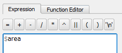

In the **Field calculator** dialog:

- Keep the **Create new field** option enabled. Set the rest of the
  options as shown below.

    

  These settings will create a new numerical field called *area_m2* with
  4 decimals, which allows you to store area values in square meters
  which are precise to the square centimeter.

- In the **Expression** text box, type in the following expression and click
  **OK**.

    `$area`

    

**About the expression:** `$area` is a function that retrieves the
feature's geometry area according to project's settings. With this
lesson project's settings, it will return the ellipsoidal area
calculated over the GRS 1980 Ellipsoid (as per the EPSG) in square
meters.

Looking at the attributes table, you can confirm that a new field called
*area_m2* exists and it's populated with values. You will notice a small
difference compared with *SHAPE_2_AR* column values, probably because
the original area provided with the data was calculated using planimetric
algorithms, which are less accurate than ellipsoidal ones.

Click **Next step** once you are done.